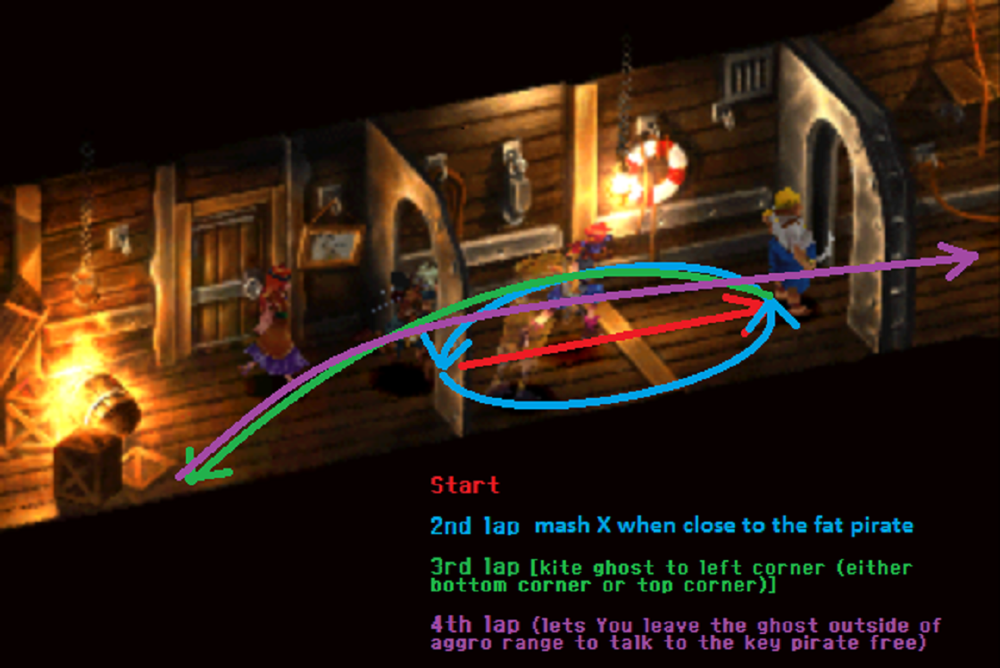

# Chrono Cross

## Disclaimer

- Anything condescending that are written in these notes are meant for the main user of these notes which is the owner. Having said that, the owner has no responsibility to apologize to anyone who has been offended reading these notes. You have been warned.
- The goal of these notes is to allow runners and casual players to find the points of the run that they need to get to in order to finish the game. If you only need the boss fight strategies consider looking for EvilAsh's notes in the [Chrono Cross Compedium][1].
- Please DM me on discord or tag me on CC channel for typos that you have found within the notes.

## Useful General Knowledge

- [General Knowledge][2]
- SuperHandi's [Notes][3]
- CarbonDrank's [Notes][4]

## Mama Komodo

### Fort Dragonia Dream Sequence

- Skip Cutscene (Press Select), remember to hold O to run.
- Avoid all encounters, bridges to help avoid bats.
- Run past elevator to pull characters in.

### Arni Village

- Talk to Leena, then head to the Shop
- Shop
  - 2 Fireballs
- Menu
  - Serge - Allocate Elements
    - Level 1 - Fireball / Fill Blanks
  - Options
    - Accuracy Selection: Manual
    - O Button Pressed: Walk
- Go to Beach

**Note:** Look for one Feather, one Fang and two Humours as drops from all the Komodo Fights. There are backups later if you don't get them.

### Komodo Fights

Komodo fights you will do are the Rock Komodo, Jump Komodo and Chase Komodo in that order. You can take the Beach Bum before Jump Komodo for a Humour drop.

**Note:** all HP Values are **HALF** the listed amount with only Serge in the party

Pup: 28 HP - (Bone and Feather)
Beachbum: 32 HP - (Humour and Tablet)
SandSquirt - 26 HP - (Fang and Scale)
Mother Dragon - 152 HP - (Fang and Tablet)

#### Rock Komodo, Jump Komodo

- Spam 2
- Fireball (Level 1 or 3)
- Spam 2

#### Chase Komodo and Mama Komodo

- 2 / 2
- Level 1 Fireball, Mama Komodo will appear.

#### Momma Komodo (76)

- 2 / 2 or 1 / 2 if Stamina Refresh is at 4.
- Fireball + 2
- Spam 2
- Use the Heal with Consumables Option
- **SPLIT AFTER THE WIN MENU**

## Solt / Peppor / Karsh

- Head to Opaasa Beach and walk to the Shore.
- Choose 2nd option on 2nd Choice box when talking to Leena to save a little bit of text, a cutscene will occur.
- Feather backup
  - Enter the hole on the southwest path before the fishest to go to island in middle or race circle.
- Take path on upper and to the left side to jump back to entrance, go to Arni Village and straight to Leena.
- Talk to Leena and Head to Cape Howl.

### Cape Howl

- You can take the Beach Bum fights or just head straight to the Karsh Battle.

#### Beach Bum Fights

**Note:** These are optional if you lack Humours, you can opt for these for a Strength up or with Leena after. The stats you get are duplicated on the Karsh battle so you can reset here if you got bad stats.

- 2 / 2
- Fireball + 2
- Spam 2
- Head up and talk to your Grave to trigger the next fight.

#### Karsh/Solt/Peppor (120HP/9AP, 54HP/9AP, 63HP/9AP)

- **Optional Marathon Strat:** Fight 2 Beach Bums for a Mini Star.
- Defend until Solt hits Serge (damage is nullified until after the battle cutscene ends)
- Kid (Target Solt) - 1 / 2 - Magma Bomb
- Serge (Target Solt) - 1 / 1 / 2 / 3 (If there are misses Fireball do 2 instead of 3 and Fireball Peppor)
- Kid - Defend (Only if no Misses)
- Serge - Fireball (Level 3) Karsh
- Kid - (Target Peppor) - 1/2 - Fireball (Level 3) Peppor
- Serge and Kid (Target Karsh) - Spam 2 to Karsh until he dies
- Use the Heal with Consumables Option
- **SPLIT AFTER THE WIN MENU**

Drops:

- Ivory Helmet/Ivory Vest/Bone Axe (Common)
- Copper/Copper/Power Glove (Rare)

## Solt / Peppor

- **Don't let Kid join the party.** Choose the 2nd option for 3 times (be careful mashing).

### Arni Village

- Get Magma Bomb hidden in the left corner of your room after Leena and Poshul join.
- Put Leena infront while running out (press select).
- Menu
  - Leena - Allocate Element
    - Magma Bomb Level 3
  - Poshul - Equip
    - Replace Ivory Mail for Ivory Vest if you need a backup humour.
  - Serge - Equip
    - Power Glove (if you got it)
- Head to Fossil Valley, if short on Humours then head to Cape Howl for a Beach Bum fight for the extra Humour
  - Leena
    - Get to Level 3
    - Magma Bomb

### Fossil Valley

- Avoid encounters, head straight following the path.

#### Solt and Peppor (84HP/7AP, 94HP/8AP)

**Note:** Leena only has 2 actions available to her before the Battle Cutscene.

- With Magmabomb
  - Leena (Target Solt) - 1 / 2 (or 3/3 if you're feeling it)
  - Solt and Peppor will do their comedy skit
  - Serge (Target Solt) - 1 / 2 - Fireball+2 Solt
  - Leena (Target Solt) - Get to Level 3 - MagmaBomb
  - Poshul (Target Solt) - 1 / 2 / 2
  - Serge / Poshul (Target Solt if he lives then Peppor) - 2 / 2 / 3
- No Magmabomb
  - Defend until Solt and Peppor will do their comedy skit
  - Serge (Target Solt) - 1 / 1 / 2 - Fireball+2
  - Poshul (Target Solt) - 2 / 2 / 3
  - Leena - 3 / 3
  - Serge / Poshul (Target Solt if he lives then Peppor) - 2 / 2 / 3
- Use the Heal with Consumables Option
- **SPLIT AFTER THE WIN MENU**

Drops:

- Copper / Uplift (Common)
- ElectroJolt / Copper (Rare)

## Ketchop

### Termina

- Put Serge infront of the party while running to Termina.
- Talk to the statue polisher, allow Kid to join you in your party.
- Replace Leena with Kid.
- Pick up the Profiteer Purse under the staircase of the mansion past the Smithy shop, head to the Smithy.
- Blacksmith
  - Disassemble
    - Profiteer Purse
    - Ivory Mail (If you need extra Humour)
  - Forge
    - Steel Swallow
    - Iron Dagger
- Talk to Pierre.
- Get Medal of Honor from the running child.
- Show the Medal of Honor to Pierre (press Square and choose Medal of Honor), talk to Pierre to get him to join the Party.
- Head to Viper Manor, optionally you can purchase 1 Antidoe and 1 Brace from Lisa's Shop before you leave.

**Note:** You don't need the Antidote and Brace, but the Bulbs from Luccia can poison and Sprain you.

### Before Viper Manor

- Menu
  - Serge - Equip
    - Steel Swallow
    - Ivory Helmet
  - Kid - Equip
    - Iron Dagger
- Tele-porter (Square while on the overworld)
  - Replace Poshul with Pierre
- Put Pierre infront of the Party.

### Viper Manor

- **Put Pierre infront of the Party.**
- Pierre will talk to the guards, just mash until they fight you.

#### Guard Fights (70HP, 84HP)

  - Serge and Kid (Attack Guards) - 2 / 2 / 3 (You can do 1 / 3 / 3 if you're feeling a bit wild for no particular reason)

- Use the Heal with Consumables Option
- **SPLIT AFTER THE WIN MENU**

Drops:

- Tablet / Copper (Common)
- PhotonRay / Meteor (Rare)

#### Solt/Peppor/Ketchop (273HP/9AP)

**Note:** Switch Pierre to being infront if you still haven't done it yet. Also, don't bother hitting Solt and Peppor.
**Appendum:** When the notes say X then X / X the "then" means you wait for the attack animation to finish before you plug your attacks again.

- Defend until Solt revives Pierre
- Serge (Target Ketchop) - 2 then 2 / 3 (You can do 1 then 3 / 3 if you're feeling cocky for crits. If you miss that's on you.)
- Kid - Defend
- Serge - Dash & Slash
- Kid - 2 / 2 / 3
- Everyone: Defend (refreshes stamina)
- Kid and Serge (Target Ketchop) - 2 / 2 / 3
- Use the Heal with Consumables Option
- **SPLIT AFTER THE WIN MENU**

Drops:

- Silver Earring / Brace (Common)
- Silver Earring / Magic Ring (Rare)

## Luccia

### Outside Viper Manor

- Get the TurnYellow behind the gate.
- Switch Serge back to front.
- Menu
  - Heal everyone with Tablets, if not yet done.
- Guard Fight
  - See Guard Fight Strats above.
- Head to the stables, avoid moving guards and the lights.

### Stables

- Talk to the Stable Master.
- Choose the option to feed 10, you'll get a Knee Pad for your trouble. (Angry Dragon Order: 2/3/5, 1/4, 2/3/5, 1/2)
- Get the Manor Key on the cabinet.
- Head to the Manor Entrance, avoid moving guards and the lights.

### Viper Manor

- Turn the statue 0/0, you'll never get it first try no matter what you try.
- Cell Guards
  - See Guard Fight Strats above.
- Head to the left side, avoid walking to the center or mashing x to avoid encounters from here on out.
- Go to Dining Room and talk to Glenn.
- Get Dragoon's Honor in the corner and get out.
- Follow Glenn and let him walk through door before going in.
- Walk into bedroom, talk to Glenn and grab revive on left hand side, then get code from the wall next to Glenn.
- Go to treasure room on the right side, and don't select anything on the passwords when prompted.
- Pick up Bronze Sword and Bronze Mail from treasure room.
- Menu
  - Serge - Equip
    - Bronze Mail
    - **Dragoon's Honor**
  - Pierre - Allocate Elements
    - Level 1
      - TurnYellow
      - Revive
- Grab the Silver Pendant on wall, just mash and don't think about it.

### Bulbs (168/10)

- Pierre (Target Bulb) - Get to Level 1 - TurnYellow Serge
- Serge (Target Bulb) - 2 / 3 / 2 (if the bulbs haven't attacked yet) or 2 / 2 / 3
- Kid (Target Bulb) - 1 / 1 / 2 / 3
- Serge and Kid (Target Remaining Bulbs) - 2 / 2 / 3
- Use the Heal with Consumables Option
- **SPLIT AFTER THE WIN MENU**

Drops:

- Eagleeye (Common)
- AeroSaucer (Rare)

## Marcy

- **Optional:** If you don't have a Brace then kill the guy with the Sprain yourself on a monster encounter and run away.
- **Optional:** If you didn't get the Ivory Helmet drop get the Bronze Helmet on the next room after Luccia (The room with the eye, chest nearest to you)
- Head up to Karsh's Room (2nd door up the stairs) and talk to the chest 20 times for Dragoon's Gauntlet.
- Menu
  - Serge - Equip
    - Dragoon's Gauntlet
  - Heal everyone with Tablets and use Antidote or Brace if poisoned or Sprained.
  - Pierre - Allocate Element
    - Eagleeye (if you got it)
- Go back to the statue and enter the code obtained from earlier.
- Head up to the Main Hall and turn left to Balthasar's Tower.

### Balthasar's Tower

- Head up to Marcy and talk to her, she'll fight you after a bit of mashing.

#### Marcy (498/7)

**Note:** Marcy will use Cat's Cradle when she hits 249 HP, you want to kill her before she spams IceBlast coz it will kill Kid outright.

- **Optional, with EagleEye:** Pierre: 1 / EagleEye Serge
- Serge - 3 / 3
- Kid - 1 / 1 / 2 / 2
  - If everything hits:
    - Serge - 1 / 2 (Marcy will attack) / 2 / 2
    - Kid - 2 (Wait for a second) / 2 / 3 (Marcy will do Cat's Cradle)
    - Serge - 1 / 2 / 2 - Dash&Slash
    - Kid - Fireball+2
  - With Misses:
    - Serge - 3 / 3
    - Kid - 1 / 1 / 2 / 2
    - Serge - 3 / 3 (Marcy will do Cat's Cradle)
    - Kid - 1 / 2 / 2
    - Serge - Dash&Slash
    - Kid - Fireball+2
- Use the Heal with Consumables Option
- **SPLIT AFTER THE WIN MENU**

Drops:

- IceBlast (Common)
- Iron (Rare)

## Lynx

### Viper Manor

- Head back to the main hall and talk to Harle.
- Hit button behind 2nd pillar on left.
- Guards (**Heal with consumables after**)
  - See Guard Fight Strats above.
- Go up elevator, and go through door straight ahead. Wait for ghost to shut his eye or else a battle will happen.

#### Lynx (861/8)

**Note:** Count crits and misses as they cancel each other out. ()'s are there to tell you that it is the current count if you hit the 3's and not for to use a specific attack. Don't be a fucking buffoon.

- **Optional, with EagleEye:** Pierre: 1 / EagleEye Serge
- Serge (Target Lynx) - 3 / 3 (1)
- Kid (Target Lynx) - 2 / 2 / 2
- Serge (Target Lynx) - 1 / 3 / 3 (2)
- Kid (Target Lynx) - 2 / 2 / 3
- Serge (Target Lynx) - 3 / 3 (3) (Repeat if you have 2 or more misses)
- Kid (Target Lynx) - 2 / 2 / 2 - Pilfer (Pray for a Magic Ring - This needs to happen here)
- Lynx should do an Imbecile in his next turn
- Pierre (Target Lynx) - 3
- Serge (Target Lynx) - 3 / 3 - Slash & Dash
- Lynx will do an Anti-White in his next turn
- Kid (Target Lynx) - 2 / 2 / 3
- Use the Heal with Consumables Option
- **SPLIT AFTER THE WIN MENU**

Drops:

- Pendragon Sigil C (Common)
- Gravitonne (Rare)

## Fargo

### Viper Manor

- Cutscene (Starting from when Kid asks you what's wrong) 28seconds
- Just keep mashing, you'll get into the Menu after Serge jumps.
- Menu
  - Kid - Equip
    - Remove Iron Dagger
  - Pierre - Allocate Elements
    - Remove All

### Guldove

- You'll wake up on a bed, go outside and watch Kid faint from poison then choose not to save her (It's the 1st option so don't think, just mash)
- Put Poshul into the party to replace Kid.
- Go back to where you were sleeping (Head up the ladder then head right), talk to Korsha and ask for his boat. Macha will advise you to head to the Shrine.
- Head to the Shrine for your Fortune (Head straight to the left from Korsha's tent all to way to the end), head to the boat after.
- Go talk to Macha and select the 2nd option to get on the boat.

### Termina

Reminder to make a Savestate here for Menu-ing Purposes

- Macha will let you roam after some cutscenes and mashing. Head to Lisa's.
- Shop (Lisa's)
  - 41 Tablets (Skip this if you're planning on buying Capsules after DeadHead)
  - 11 Medicine
  - 2 Ointment (Optional: Burn only reduces your defense and deals 2x damage on field damage aka lava)
  - 2 CurePlus
  - 2 HealAll (Just buy one if you're buying Tablets)
  - 2 AquaBeam
  - 2 AquaBall (3 if no IceBlast)
  - 2 Bushbasher
- Head to the Smith after buying.
  - Sell - Bone Axe / Iron Dagger / Bronze Sword
  - Disassemble - Silver Earring / Knee Pad / Silver Pendant
  - Forge - Ladle Fe26 / Steel Sword
- Head to the Termina Entrance for a cutscene with Glenn, then head back to Macha to have Glenn and her join the party. (Rename Glenn to G)
- Board the boat, replace Pierre and Poshul for Glenn and Macha respectively, and head to Marbule.

### Marbule

- Replace Macha with Leena while heading to Marbule.
- Shop (Straight ahead, talk to the guy in the swimming pool in the upper corner)
  - 2 TurnBlue
  - 1 TurnRed
  - 1 TurnGreen
  - 2 TurnWhite
  - 2 TurnBlack
  - 1 Strengthen
  - 1 EagleEye
  - 1 Genius
  - 1 WeakMinded
- Menu - Equip
  - Serge - Ivory Mail - Remove Ivory Helmet (Keep this if you have 2 Magic Rings)
  - Glenn - Steel Sword
  - Leena - Ladle Fe26 - Bronze Mail - Magic Ring - Ivory Helmet or Magic Ring
- Menu - Allocate Elements
  - **Press Triangle and select Healing and Supplemental first**
  - Serge
    - Level 2 - Heal All
  - Glenn
    - Level 2 - Heal All (Ignore this if you bought Tablets)
    - Level 1 - Strengthen / TurnBlue / Revive
  - Leena
    - Level 1 - EagleEye / TurnRed / TurnWhite **Cancel then Sort by Innate** / AquaBeam
    - Level 2 - CurePlus / CurePlus / AquaBall
    - Level 4 - IceBlast
    - Level 3 - BushBasher
- Board the boat, head towards Fort Dragoon and enter the fog.

### Fargo's Pirate Ship

- Just mash and run away from first fight (Can fight if Single).

#### Polly (567/18)

- Glenn - 1 - TurnBlue Serge
- Leena - Spam 1's until Level 4 - IceBlast
- Serge - 2 / 2 / 3 (2 / 3 / 2 f you're not attacked yet or again 1 / 3 / 3 if you're really feeling yourself for no particular reason)
- Serge and Glenn - 2 / 2 / 3 until Polly dies
- Use the Heal with Consumables Option
- **SPLIT AFTER THE WIN MENU**

Drops:

- MagmaBurst (Common / Rare)

#### Fargo (693/8)

- Glenn - 1 - Strengthen Serge
- Leena - 1 - TurnRed Serge
- Serge - 2 / 3 / 2 (if Fargo has not attacked yet) or 2 / 2 / 3
- Glenn - 2 / 2 / 3
- If everything hits:
  - Serge - 2 / 2 / 2 - X-Strike
- With misses:
  - Serge - 2 / 2 / 3
  - Glenn - Do 2's according to the amount of misses - X-Strike
- Use the Heal with Consumables Option
- **SPLIT AFTER THE WIN MENU**

Drops:

- Meteorite (Common)
- PhotonBeam (Rare)

## Dead Head

### Fargo's former Pirate Ship now promoted to Ghost Ship

- Run away from the fight in the cabin and get out.
- Check the door infront of the injured guy, it'll say that you'll need a key.

### Finding the Key (Image Credits: EvilAsh25)

The key can be found in 1 of the 4 People in this section but you'll have to start from the farthest person from the door to the nearest one. Obviously, you will head to the door once you find the key from one person. Don't bother fighting / talking your way to everybody if you got the key early.

- Avoid the Ghosts popping about, head left and go up the ladder, enter the first door on the right and enter the vent.
- Get out of the room and talk to the guy on the blockade.
  - Ghost Dance: Either this or fight the Ghost 
- When he lets you pass, then talk to the guy past the door. **Make sure that the textbox conversation ends before you walk away from him or else he will have the key after all the fighting you have done. I cannot stress this enough, END HIS TEXTBOX BEFORE YOU LEAVE YOU MORON**
- Head through the vent, pick up the chest(Panacea, this is important) and fight the ghost, if it's 4 Monsters run away and try again.
  - Check Ghost / Skeleton Fight Strats below
- Talk to the guy after the fight, and hopefully he has the key, if not go back to the room and fight the skeleton on your right, if it's 4 Monsters run away and try again.
  - Check Ghost / Skeleton Fights Strats below.
- To the the guy for the key if you still don't have it then proceed to the ladder down and to the 2nd door on the right. Fight the Skeleton fighting the guy.
  - Check Ghost / Skeleton Fight Strats below
- Talk to the guy after, and finally get the freaking stupid key. (You're so screwed by RNG at this point if you had to do this btw, I'm so sorry for you)

#### Ghost / Skeleton Fights

- 2 Skeletons
  - Serge - 2 / 3 (Dead Skelly) - Dash & Slash other Skelly
  - Glenn - 2 / 2 / 3 remaining
- 1 Skeleton, 1 Ghost
  - Serge - 2 / 3 (Dead Skelly)
  - Glenn - 1 / 2 (Skelly if it survives) - X-Strike
- 2 Ghost
  - Serge - 2 (Wait for a second) / 2 / 3 (Dead Ghost)
  - Glenn - 1 / 2 (Ghost if it survives) - X-Strike

### Getting up to the Deck

- Go through the door, and move forward past 1 cannon, take hard right to dodge, then head out to the end.
- Dodge the ghosts, go down the ladder, dodge the balls, go up enter the room, dodge the ghosts and balls again, and head up to the stairs.
- At the top of the last stairs, pick up PhotonBeam.

#### DeadHead (735/6)

**Note:** If you're scared of Leena missing she can go first instead of Glenn for the stamina refresh.

- Glenn - 1 - Strengthen Serge
- Leena - 1 - EagleEye on Serge
- Serge - 3 / 3
- Leena - Get to Level 4 - CurePlus Dehead
- Serge - 3 / 3
- Glenn - 2 / 2
- Leena - CurePlus Deadhead
- Serge - 3 / 2
- Glenn - X-Strike
- Use the Heal with Consumables Option
- **SPLIT AFTER THE WIN MENU**

Drops:

- Hell Soul (Common)
- HellBound (Rare)

## Fire Dragon

- Mash and head to Marbule

### Marbule

- Talk to the guy beside the swimming pool dude and start shopping
  - 1 Diminish
  - 1 Magnify (Sell 2 Panacea if necessary)
- Talk to the Swimming Pool Guy and buy all the Capsules you can afford.
- Put Glenn in first while running out.
- Head to Mt. Pyre

### Mt. Pyre

- Put Glenn in first while running if you haven't done so. Do a Menu **after** you crossed the Lava.
- Menu - Equip
  - Serge - Remove All Accessories (Press Left and Triangle)
  - Glenn - Dragoon's Gauntlet - Power Glove (if you have it)
  - Leena - Dragoon's Honor (Replace Ivory Helmet if you're full)
- Menu - Allocate Elements
  - **Press Triangle and select Healing and Supplemental first**
  - Glenn
    - Level 1 - Remove Strengthen / TurnBlue Stays / Replace Revive with AquaBeam
    - Level 4 - Magnify (First Slot) / **Panacea x5 (Second Slot)**
  - Leena
    - Level 1 - Replace EagleEye for Strengthen
    - Level 5 - Diminish
  - Serge
    - Level 2 - Replace Cure with Revive / Medicine
    - Level 1 - EagleEye / TurnBlue / Genius / AquaBall
    - Level 4 - AquaBall / BushBasher
- Menu - Use Elements
  - Capsule Everyone.
- Head up to the ladder.

#### Solt/Pepper (525/6 507/8)

- Leena (Target Solt) - 1 - Strengthen Glenn
- Serge (Target Solt) - 1 - EagleEye Glenn
- Glenn (Target Solt) - 3 / 3
- Leena (Target Solt) - Get to Level 4 - BushBasher Peppor (Target Solt instead of Glenn Hits)
- Glenn (Target Solt) - 3 / 3 and Solt dies
- Serge (Target Peppor) - 1 / 2 / 2 - BushBasher (Don't use Bushbasher if Glenn Crits)
- Glenn (Target Peppor) - 3 / 3
- Use the Heal with Consumables Option
- **SPLIT AFTER THE WIN MENU**

Drops:

- Iron Vest/Iron Mail (Common)
- Sky Djinn Ring/Dragoon Gauntlet (Rare)

### Continuing Mt. Pyre

- Head straight through the lava and to the top. Glenn is still at first.
- Menu on the Save Sphere.
- Menu
  - Leena - Equip - Iron Vest or Sky Djinn Ring
  - Serge - Equip - Iron Mail (if you have it)
  - Glenn - Equip - Dragoon Gauntlet (if you have it)
  - **Heal everyone with Capsules.**
  - **Optional: SAVE THE GAME** You can't run from the next boss, he'll just be like "oh no you don't" and fight you immediately.
- Head into the cave and start praying to the gods.

#### Fire Dragon (892/6)

**Note:** Fire Dragon is a bitch, he can kill Leena or Glenn if you ain't careful. Be prepared to adhoc the fight on this one. Remember that only Glenn has Magnify and Serge has Revive so determine for yourself if the Fight is worth continuing if Glenn or Serge was the person to die. Reset the game instead of running away. If you have Heal Alls then get back to the fight and get to Level 2 then run away.

- Normal Strats
  - Serge - 1 - EagleEye Glenn
  - If Attacked:
    - Serge - Get to Level 1 - EagleEye Glenn (If not done yet)
    - Leena - 1 / 1 - AquaBall
    - Serge - 1 / 1 - TurnBlue Glenn
    - Glenn - 3 / 3
  - If Not Attacked
    - Glenn - 3 / 3
    - Leena - 1 - AquaBall
    - Serge - 1's until Glenn gets 5 Stamina) - TurnBlue Glenn
    - Glenn - 3 / 3
  - FireDragon - FireBreath
  - Leena - Get to Level 5
  - Serge - Genius Leena
  - Everyone - Defend (Optional if you're only about to be FireBreath'd again)
  - Glenn - Magnify
  - Leena - AquaBall -2
  - Serge - AquaBall
  - Leena - IceBlast
- 20 Str Glenn, 14 Mag Leena Strats
  - Serge - 1 - Eagle Eye Glenn
  - Glenn - 3 / 3
  - Serge - 1 - TurnBlue Glenn
  - Leena - 1 / 1 - AquaBall
  - Glenn - 3 / 3
  - Leena - 1 / 1 / 1 - IceBlast
  - Serge - Defend
  - Glenn - 3 / 3
  - Serge - 2 / 3
  - Glenn - 2 / 3
- **Use the Heal with Consumables Option**
- **SPLIT AFTER THE WIN MENU**

Drops:

- Weaken (Common)
- Magic Ring (Rare)

## Three Devas

- **Heal everyone with Capsules if you forgot**
- Head up and fight the Three Devas

### Karsh/Zoah/Marcy (388/8 457/11 285/6)

- Marcy Phase
  - Leena - 1 - Strengthen Glenn
  - Glenn (Target Zoah) - 1 / 2 (Skip EagleEye later if Zoah attacks here)
  - Serge (Target Marcy if Str Sum is less than 35, Zoah if Glenn 20 or 21 Str) - 1 / 2
  - Serge (Target Marcy) - X-Strike
- Zoah Phase
  - Leena (Target Zoah) - Get to Level 4 - BushBasher Glenn
  - Serge - 1 - EagleEye Glenn
  - Glenn (Target Zoah) - 3 / 3
  - Leena - 2's until Zoah dies if he lives
- Karsh Phase
  - Leena - Get to Level 4
  - Serge - 1 - Turn Blue Glenn
  - Leena - IceBlast
  - Glenn - 3 / 3
  - Serge - 2 / 2 / 2 if Karsh lives
  - Glenn - 3 / 3
- Use the Heal with Consumables Option
- **SPLIT AFTER THE WIN MENU**

Drops:

- Eagle Eye / Gold Earring / Iron Vest (Common)
- Silver Earring / Gold Earring / Dancing Shoes (Rare)

## Giant Gloop

**Note:** The Fights from here on out are going to get trickier, some will just need you to attack but most will prioritize on Element Spams. The notes will also adjust to this as well, advising you to get to a certain level instead of picking your attacks. Pick your attacks in priority to getting the levels as safe and as assuredly as possible instead of fast. It's highly adviseable to start counting Enemy AP here too (Bosses are labelled as Boss HP Value / AP Value, check [General Information][2] for more information.) so you'll know when the next attack will be. It'll return to attack picking should it be needed.

- Head into Fort Dragonia and Fight your next Boss.

### Fort Dragonia

#### Dragoon (735/9)

- Glenn - Get to Level 4
- If Not Attacked and Glenn gets to Level 4: 
  - Leena - 2 / 3
  - Glenn - Magnify
  - Leena - Get to Level 5 (Skip if you're already Level 5)
  - Serge - 1 - AquaBall
  - Leena - Iceblast
  - Glenn - Defend (or 2 / 2 if ahead of AP)
  - Leena - AquaBall
  - Glenn - 2 / 2 - AquaBeam
- If Attacked: 
  - Glenn - Get to Level 4 - Magnify
  - Leena - Get to Level 5
  - Serge - 1 - AquaBall
  - Leena - Iceblast
  - Glenn - Defend (or 2 / 2 if ahead of AP)
  - Leena - AquaBall
  - Glenn - 2 / 2 - AquaBeam
- Use the Heal with Consumables Option
- **SPLIT AFTER THE WIN MENU**

Drops:

- Frog Prince (Common/Rare)

### Frog Prince Dragonia

- Menu - Allocate Elements
  - Leena - **Sort by Innate**
    - Level 1 - Cure
    - Level 5 - FrogPrince
  - Serge
    - Level 1 - WeakMinded (Top Slot)
- Menu - Equip
  - Glenn - Iron Vest
  - Leena - Magic Ring (If you have an accessory slot available)
  - Serge - Golden Earring - Magic Ring (If Leena's Accessory Slot is full)

**Note:** You need Leena to hit and get the Element Levels so she can spam Elements, it's riskier to take the 2 Magic Rings, Sky Djinn Ring than Dragoon's Honor, and 2 Magic Rings.

- Move Serge to First while running. (Order should be Serge, Glenn, Leena)
- Head to the Main Hall and head to the Bottom Left Door, avoid going near the bats as they will zoom in on you once they realize you're near them. Head to the Door near the Blue Shifter Pad, and activate the Switch (Order should be Serge, Glenn, Leena)
- Follow the path and activate the blue switch, hit select once so the order will be Glenn, Leena, Serge
- Head to the Blue Shifter Pad, it'll shift your order to Leena, Glenn, Serge, and activate the Maze Switch again.
- Go up the stairs that you activated and talk to the tablet infront of the Altar, then talk to the Altar, avoid the Bats again.
- Go back to the Main Hall and head to the Upper Left Door. Be careful of the Flying Bat while moving around.
- Head to the left side and hit the bottom chest
- Cross to the right side and hit the bottom chest then the top chest.
- Take the upper path and hit the right chest then the left chest
- Cross the path all the way to the other side. Hit the blue switch to activate the stairs and enter the room to go to the Altar.

#### Giant Gloop (840/8)

- If Leena is below 15 Magic
  - Leena - Get to Level 5 - Turn Red Gloop
- Glenn - Get to Level 4 - Magnify
- Serge - 1 - Genius
- Leena - Get to Level 4 - IceBlast
- Everyone - Defend
- If Leena is hit with a Blue Status Effect or if you need one more Blue element and someone has a status effect that is not Frozen
  - Serge - Get to Level 2 - Medicine Status Affected Ally
- Else if you need a Blue Element on the Field
  - Serge And Or Glenn - 1 - AquaBeam
- Else
  - Leena - Get to Level 5 - Frog Prince
- Heal with Consumables
- Use the Heal with Consumables Option
- **SPLIT AFTER THE WIN MENU**

Drops:

- AquaBall (Common)
- IceBlast (Rare)

## Taurusoid

### Frog Prince Dragonia

- Talk to the Altar.
- Go back to the Main Hall, and go to the Upper Right Door. Head through the left pass after waiting for the Golem to get out of the way for you, you simply have no choice on the matter.
- Follow the path, and head out to the entry
- Follow the path again to the entry upper left corner of the room, be careful against the Invisible Enemies.
- Go down, smash your face down the cliff to lure the golem into jumping down then go up the stairs and follow the path to the entry.
- Head down and be careful on the bottom corner to not get an encounter. Follow the path, hit the blue switch to activate the stairs and enter the room up to go to the Altar.

#### Taurusoid (1260/11)

**Note:** It is imperative to check your stamina during the Frog Prince Setup. If Leena doesn't have the Stamina to cast Frog Prince Tausuroid will just destroy your setup with a Choke Slam.

- Leena - Get to Level 5 - (Only if Leena is below 14 Magic) TurnRed Taurusoid
- If Interrupted and Leena or Serge are hit and their hp is below 120
  - Leena - Get to Level 4 - Cure Leena or Serge
- Else 
  - Leena - Get to Level 5 - (Only if Leena is below 14 Magic) TurnRed Taurusoid
- Serge - Get to Level 2 - WeakMinded (1 - Genius if Leena has 18 Mag)
- Glenn - Get to Level 4
- Serge - Genius Leena
- Leena - Get to Level 5 - Defend
- Everyone - Defend
- **IF TAURUSOID HASN'T DONE BACKDROP PRIOR TO THIS HAVE EVERYONE DEFEND UNTIL HE DOES HIS BACKDROP. DO NOT MAGNIFY UNTIL HE DOES. A CHARACTER WILL DIE IF YOU DO NOT FOLLOW THIS**
- If Leena Dies
  - Serge - Get to Level 4 - Revive
  - Everyone - Defend for Chokeslam
- Glenn - Magnify
- Leena - AquaBall
- Serge - AquaBall (TurnBlue Leena if 16-17 Mag, AquaBall if you skipped WeakMinded)
- Glenn - 1 - AquaBeam (TurnBlue anyone not Taurosoid, if Leena is at Mag 15 - 17)
- Leena - Get back to Level 5 - FrogPrince
- Use the Heal with Consumables Option
- **SPLIT AFTER THE WIN MENU**

Drops:

- Carapace (Common)
- Iron Vest (Rare)

## Sun of a Gun

### Frog Prince Dragonia

- Talk to the altar and head back out to the Main Hall. Put Serge infront of the Party.
- Head to the Bottom Right Door, Turn the statue to the South, and Hit the altar.
- Head to out and take the Ladder up. Go back to the Main Hall and Head to the Elevator.

#### Sun of a Gun (383/7)

**Note:** Count Sun of a Gun AP during the fight to determine the best way to deal with him.

**Note:** Two TurnBlues will cancel each other out so just target Sun of a Gun with it.

- Serge - Get to Level 2
- If Not Attacked
  - Leena - 3 / 3 (It's fine if one of 3's misses)
  - Serge - TurnBlue
  - Glenn - TurnBlue
  - Serge - AquaBall
  - Leena - Get to Level 5 - FrogPrince
- If Attacked
  - Leena - Get to Level 5
  - Sun Of A Gun - KissyWissy and ModeChange
  - If Serge or Leena are asleep
    - Glenn - Panacea Sleeping Character
    - Everyone - Defend
    - Proceed with If Not Attacked Strats ignoring the first 3 / 3 with Leena (You're already level 5 why the hell are you going to do 3 / 3?)
  - If Glenn is asleep
    - Serge - TurnBlue Leena
    - Leena - AquaBeam
    - Serge - Defend
    - Leena - 1 (Must Hit)
    - Serge - AquaBall
    - Leena - FrogPrince
- **Heal with Consumables**
- **SPLIT AFTER THE WIN MENU**

Drops:

- Iron (Common / Rare)

## Bunyip

### Frog Prince Dragonia

- Hit the altar, and go up the elevator to the 2nd Floor
- Do the Dream Sequence Route only with harder things to dodge + bats.

#### Bunyip (420/10 then 1260/10)
**Bunyip Phase 1 will cast Volcano after MagmaBomb and will kill Leena if you're not counting AP Properly**

- Phase 1
  - Leena - Get to Level 5
  - Good Start (Leena gets to Level 5 before Bunyip Attacks)
    - Serge - 1 - Genius Leena
    - Glenn - Get to level 4 - Magnify
    - Serge - 1
    - Leena - IceBlast
    - Bunyip should transform here, if not do 2 / 2 with Serge
  - Bad Start (Bunyip attacks at Leena's Turn)
    - Leena - Get to Level 4
    - Serge - 1 - Genius Leena (Skip this if you're lacking in AP)
    - Glenn - Get to level 4 - Magnify
    - Serge - 1
    - Leena - IceBlast
    - Bunyip should transform here, if not do 2 / 2 with Serge
- Phase 2
  - Serge - Get to Level 5 (AquaBall if Attacked here)
  - Glenn - 1 (Until Bunyip attacks) - AquaBeam
  - Serge - AquaBall
  - Leena - Get to Level 5 - FrogPrince
  - Serge - Get to Level 5 - Luminaire
  - Leena - AquaBall
  - Glenn and Serge - 2 / 2 / 3 until Bunyip dies
- Use the Heal with Consumables Option
- **SPLIT AFTER THE WIN MENU**

Drops:

- Gravitonne (Common)
- HellBound (Rare)

## Lynx

### Frog Prince Dragonia 2nd Floor

- Dodge everything to get back to the center platform.

#### General Viper (861/7)

- Leena - 1 - Strengthen Glenn
- Serge - 1 - Eagleeye Glenn
- If Not Attacked
  - Glenn - 3 / 3
  - Leena - Get to Level 3 - BushBasher
  - Glenn Strength Strats (use Else if you missed on Glenn 3 / 3)
    - 27 Strength Or Crit | 27 Strength and 18 Magic Leena
      - Glenn - 2 - SonicSword
    - 24 - 26 Strength
      - Glenn - 3 - SonicSword
    - Else
      - Serge - 1 / 1 (doesn't matter if you hit or miss)
      - Glenn - 3 / 3 - Viper Element - SonicSword
- If Attacked
  - Glenn 26 Strength
    - Glenn - 2
    - Serge - 1 / 1 (doesn't matter if you hit or miss)
    - Glenn - 3 / 3
    - Leena - Get to Level 3 - BushBasher
    - Glenn - 2 - SonicSword
  - Glenn 24 Strength
    - Glenn - 2
    - Leena - 1
    - Glenn - 3 / 3
    - Leena - Get to Level 3 - BushBasher
    - Glenn - 3 - SonicSword
  - Else
    - Glenn - 3 / 3
    - Leena - Get to Level 3 - BushBasher
    - Serge - 1 / 1 (doesn't matter if you hit or miss)
    - Glenn - 3 / 3 - SonicSword
- **Heal with Consumables and pray for a Gauntlet Drop**

**Note:** Consider killing the run when you don't get a Gauntlet Drop or reduce your STR count by 3 so you know what you're lacking.

Drops:

- Dragoon Gauntlet (Common)
- Mythril Mail (Rare)

#### Lynx (1050/7)

- Setup Phase
  - Leena - Get to Level 2
  - If Not Attacked
    - Serge - 1 / 2
    - Glenn - 2 (3 if not attacked yet)
  - If Attacked
    - Serge - 1 / 1 (if Serge is hit with GlideHook)
  - Leena - Strengthen Glenn
  - Serge - EagleEye Glenn
  - Leena - TurnWhite Glenn
  - **Only if Serge is hit** Serge - Defend
- Attack Phase
  - Glenn - 3 / 3
  - Serge - 1 / 2 / 2
  - Glenn - 3 / 3
  - Serge - Dash&Slash (2 / 2 / 2 if Lynx casted WeakMinded or you can Dash&Slash)
  - Leena - 2 / 3 (Only if you managed to cast Dash&Slash)
  - Glenn and Serge - 3 / 3 until Lynx dies
- **DON'T HEAL**
- **SPLIT AFTER THE WIN MENU**

Drops:

- Pendragon Sigil B (Common)
- Sky Djinn Ring (Rare)

## Radius

### Body Shift Dragonia

- Cut Scene 1 - 0:32
- Cut Scene 2 - 0:45 (**Hold Down while Mashing**)
- Defend against your Party and let them finish you.
- Cut Scene 3 - 0:51
- Cut Scene 4 - 1:00

### Sprigg's Crayola World

- Climb the ladder and go knock down an orange from the leaf.
- Run to the house when Sprigg leaves to enter the house.
- Sprigg joins the Party
- Head up to the lighthouse at the top of the hill.
- Enter door to the left, and then follow the Serge on the bottom to figure out which door to open.

### Getting out to the World

- Harle joins the Party.
- Head all the way down, and enter the pit at the bottom. No switches need to be hit.
- Head out of the Marsh to Opassa Beach while putting Lynx to 2nd.
- Menu - Equip
  - Harle - Remove Mythril Mail (Skip if dropped by Viper) - Dragoon Gauntlet - Dragoon Gauntlet - Magic Ring (If you have space Silver Earring / Dancing Shoes)
  - Lynx - Mythril Mail - Ivory Helmet or Power Glove - Dragoon Gauntlet if there is Extra
  - Sprigg - Gold Earring - Dragoon's Honor
  - Harle - Iron Mail

### Opassa Beach

- Use the Astral Amulet.
- Put Harle in First.

### Arni Village

- Select out to move Lynx when you hit ramp.
- Go to your house and talk to Serge's Mom

#### Radius (787/7)

- Sprigg - Get to Level 5 - Doppelganger Lagoonate
- Harle - 2 / 2 / 2
- Lagoonate - 3
- Harle - 3
- Harle & Lagoonate - 3 / 3 until Radius dies
- Use the Heal with Consumables Option
- **SPLIT AFTER THE WIN MENU**

Drops:

- Heal (Common)
- Magnify (Rare)

## Sage of Marbule

### Arni Village

- Radius joins your party. Rename him to R, don't put him on the main party.
- Mash X to put Lynx to First.
- Head out and put Harle at First. Put Lynx back infront after you Leave Arni.
- Head to Termina.

### Termina

Reminder to make a Savestate here for Menu-ing Purposes

- Head to Termina, then go to the left just up the stairs and talk to the guard.
- Go to Lisa's Shop and Start Shopping
  - Max Capsules (Required if you skipped Marbule Capsules and optional if you did and you wanna play safe)
  - 11 Antidote
  - 11 Ointment
  - 11 Brace
  - 11 Blackout
  - 11 HealAll
  - 2 AeroBlaster
  - Max IceBlast you can afford
- Head to Viper Manor

### Viper Manor

- Head straight to the entrance . Go to the right and enter the hut which leads to an underground cavern.
- Head down and then up the side on the mini waterfall and to the left.
- Now that you are in the sewers, make your way up the ladder and head up to meet Norris.
- Norris joins your party. Rename him to N, don't put him on the main party.
- Go to the port and board the boat. Now head to Marbule.

### Marbule

- Go talk to the guy on or after the bridge, ask about the dead sea(2nd Option) and run away. You don't have to sit there and listen to him.
- Head to the Zelbess

### Zelbess

- Head downstairs and down the ladder to the last room before the guard to talk to the sage. Try to follow him through the door.
- Go talk to Fargo. Play Roulette with him and try and get the cursor between North and East using paused to make sure it lands there. Hold X and unpause and you should hit South. Also if Fargo lands on East just hold X.
- **Go downstairs and go to the inn (below the casino)**
- Go watch the magic show in the first door past the ladder. Re-enter to get turned into cats and go unrig the game. Go back and talk to Fargo again, beat him this time, put Sprigg into First.
  - Menu - Allocate Elements (The notes presume you're doing this menu before Sage to listen to Dilemma, tho it's not recommended because sometimes you slow down the menus to listen more. Truly a Dilemma.)
  - Sprigg - **Press Triangle and select Attack first**
    - Level 6 - PhotonBeam
  - Lynx - **Press Triangle and select Healing and Supplemental first**
    - Level 2 - HealAll / HealAll / **Blackout x5** / **Revive**
    - Level 1 - Cure Plus / Cure Plus / TurnBlue / Strengthen / TurnWhite / WeakMinded / AeroBlaster / IceBlast
    - Level 6 - IceBlast
    - Level 4 - Magnify
  - Harle
    - Level 2 - HealAll / HealAll
    - Level 1 - TurnBlue / EagleEye / TurnRed / TurnWhite / TurnBlack
    - Level 4 - Panacea x5 / Diminish
    - Level 5 - Meteorite / IceBlast
    - Level 6 - AeroBlaster
- After you get access go to the grand slam and talk to the sage. When he asks what you want, first choose nothing(2). Then mash.

#### Sage (1575/7)

- Sprigg - Get to Level 5 - Doppelganger Lagoonate
- Lynx - 1 - Strengthen Lagoonate
- Harle - 1 - Turnblack Lagoonate
- Lagoonate - 1 / 3
- Lynx - 2 / 2 / 2
- Lagoon - 3 / 3
- Lynx - 2 / 2 / 2
- Lagoonate - 3 / 3
- Use the Heal with Consumables Option
- **SPLIT AFTER THE WIN MENU**

Drops:

- Mythril Helmet (Common/Rare)

## Garai

### Zelbess

- Go back to your boat and move Lynx to first. Head to the Dead Sea and use the Fiddlers Crab.
- Radius will tell you go to Hermit's Hideaway, so head there.

### Hermit's Hideaway

- Wait at the top of the ladder until Radius comes out and get Garai's Keepsake from him. (He's an old man so he moves waaay too slow), head to Isle of the Damned.

### Isle of the Damned

- Move Harle to first, then go fight the Willow Wisps before the next part.

#### Willow Wisp

**Note:** Run Away from 4 Enemies

- Harle - 2 / 3 - IceBlast (Moonbeams if you miss or have 3 wisps)
- Lynx - 2 / 2 / 2 - GlideHook (If Needed)

### Isle of the Damned

- Head up and left while dodging the first skeleton, then down the path below the ribs. Then go up and use Garai's Keepsake on the Mirror.
- Pull the Will-O-Wisp down to WightKnight and Fight him there. Switch Lynx to front after.

#### WightKnight

**NOTE:** Sprigg has to be the last one to kill WightKnight no matter what.

- Setup Phase
  - Harle - Get to Level 6 - TurnBlack WightKnight
  - Lynx - Get to Level 5
  - Sprigg - Get to Level 6
- Attack Phase
  - Lynx - WeakMinded
  - Harle - Defend
  - Lynx - Magnify
  - Harle - Meteorite
  - Sprigg - PhotonBeam

### Isle of the Damned

- Switch Sprigg to first and enter the Black Entry Way in the middle
- Pray to the Gods

#### Garai (2086/6)

Reminder to make a Savestate here for Practice Purposes

**Note:** Act accordingly and get diminish and doppelganger ASAP.

**Garai Pattern:** Attack x1, TripleCut, Attack x2, Attack x3, WillBreaker

- Sprigg - 2 
  - If Sprigg Hits
    - Sprigg - 2 / 1 (Stop if Interrupted) - Doppelganger WightKnight
  - If Sprigg Misses
    - Sprigg - 2 / 2 - then Proceed to Sprigg got interrupted getting to Level 5 strats
- Sprigg got to Level 5 w/o interruptions
  - Sprigg - Doppelganger WightKnight
  - Harle - Get to Level 4 - Diminish (You can do this first then DoppelGanger if you're scared of Missing)
  - WightKnight (Only if Garai doesn't Attack) - 1 / 3
  - Lynx - 1 (1 / 3 if WightKnight Attacked Prior)- Strengthen WightKnight
  - Harle (Only if WightKnight is at 6 Stamina) - Defend
  - WightKnight - 3 / 3
  - Lynx - 3 - Defend
  - Harle - Defend
  - WightKnight - 3 / 3
  - Lynx - 2 / 3 - GlideHook (or Revive WK)
  - WightKnight - 2 / 3
- Sprigg got interrupted getting to Level 5
  - Harle - Get to Level 4 - Diminish
  - Sprigg - Get to Level 5 - Doppelganger WightKnight
  - Lynx - 1 - Strengthen WightKnight
  - Harle - Defend
  - Wightknight - 1 / 3
  - Harle - 1 - TurnBlack Garai
  - Lynx - Defend twice
  - Harle - Defend
  - WightKnight - 2 / 3
  - Lynx - 1 / 1 / 2 - GlideHook
  - WightKnight - 2 / 3
- Use the Heal with Consumables Option
- **SPLIT AFTER THE WIN MENU**

Drops:

- Dragoon's Honor (Common/Rare)

## HighwayMan

### Isle of the Damned

- Move Lynx to first and head to the Dead Sea.
- Heal Everyone if you haven't.

### Dead Sea

- Mash through, and enter the first city to the right, move Sprigg to first.

#### HighwayMan (2100/7)

**Note:** ExhaustGas after 2 HighwayMan Attacks Phases prioritize getting Harle to level 4 after the 2nd Attack.
**HighwayMan Pattern:** Attack x2, ExhaustGas, Rampage, Attack x3

- Sprigg - Get to Level 5 - DoppelGanger WightKnight
  - Sprigg got to Level 5 or WightKnight before HighwayMan Attacks
    - Sprigg - DoppelGanger WightKnight
    - Lynx - 1 - Strengthen WightKnight
    - Harle - 1's until WightKnight is at 5 Stamina - TurnWhite WightKnight
    - WightKnight - 3 / 3
    - HighwayMan - 2nd Attack
    - Harle - Get to Level 5
    - Lynx - 1's until WightKnight is at 5 Stamina - TurnWhite Lynx
    - WightKnight - 3 / 3
    - HighwayMan - ExhaustGas
    - Harle - 1's until WightKnight is at 5 Stamina Panacea WightKnight (Meteorite if WightKnight is not hit by darkness)
    - WightKnight - 3 / 3
    - HighwayMan - Rampage
    - Lynx - 3
    - WightKnight - 3
  - Sprigg got interrupted
    - Sprigg - Get to Level 5 - DoppelGanger WightKnight
    - Lynx - 1 - Strengthen WightKnight
    - HighwayMan - 2nd Attack somewhere in between Harle's Attacks
    - Harle - 1's until AP Allows or HighwayMan attacks
    - WightKnight - (1 or 2 or 3) / 3
    - Harle - TurnWhite WightKnight
    - Lynx - 1's to refresh Harle's Stamina needed to get to Level 3 - TurnWhite Lynx (+1 Harle Stamina due to Element Use)
    - Harle - Get to Level 4 (Hope it hits)
    - HighwayMan - ExhaustGas
    - Harle - Panacea WightKnight (if WightKnight is not hit by darkness)
    - Lynx - Best Attacks you can do that puts WightKnight at 6 Stamina
    - WightKnight - 3 / 3
    - HighwayMan - Rampage
    - Lynx - 2 / 2 / 2 (or 1 / 2 / 2 - Blackout Lynx)
    - WightKnight - 3 / 3
    - WightKnight and Lynx - 3 / 3 until HighwayMan dies
- Use the Heal with Consumables Option
- **SPLIT AFTER THE WIN MENU**

Drops:

- Nimble (Common)
- Mythril (Rare)

## Miguel

### Dead Sea

- Move Lynx to first.
- Head to the center of the Dead Sea.
- Head straight up to the stairs and turn left on the top and enter the Blue Passage way.
- Avoid battling the ghosts and head out the screen to the left. Keep going up and take the exit on the top right of the screen. Keep going forward until you reach the save sphere.
- Grab the Screwy Dress on the right of the Plaza, go back to the save sphere for a safety save.

#### Miguel (2047/6)

Reminder to make a Savestate here for Practice Purposes

**Note:** Count 1500 damage or else MeteorShower will ensue. Get Diminish out before HolyDragonSword.
**Miguel Attack Pattern:** AntiBlack, StrongMinded, WeakMinded+HolyDragonSword, Attack, TurnBlack+PhotonBeam, Reactionary MeteorShower at below 1500 HP

- Sprigg - Get to Level 5 - DoppelGanger WightKnight
- **Normal Start**
  - Lynx - Get to Level 1
  - Harle - Get to Level 4
  - Everyone - Defend until StrongMinded
  - Miguel - StrongMinded
  - Lynx - Strengthen WightKnight
  - Harle - Get to Level 4 - Diminish
  - WightKnight - 3 / 3
  - Miguel - HolyDragSword
  - Lynx - 1 / 2 / 2 (use lynx when harle empties her stamina but just the remaining attacks)
  - WightKnight - 3 / 2 (Only do 3 if Crit anywhere, 3 / 3 if no Strengthen)
  - Harle - 1 / 1 / 2 - MoonBeams (Skip Element if Crit)
  - WightKnight - 3 / 3
- **Sprigg Level 5 and AntiBlack on Harle**
  - Sprigg - DoppelGanger WightKnight
  - Lynx - Get to Level 3 - Strengthen WightKnight
  - Harle - Get to Level 4
  - Everyone - Defend until Miguel does StrongMinded
  - Miguel - StrongMinded
  - Harle - Get to Level 4 (defend if already at Level 4)
  - Lynx - Blackout Harle
  - Harle - Diminish
  - WightKnight - 3 / 3
  - Miguel - HolyDragSword
  - Harle - 1 / 2 / 2
  - WightKnight - 2 / 3 (Only do 3 if Crit)
  - Lynx - 1 / 1 / 2 - GlideHook
  - WightKnight - 3 / 3
- **Sprigg Level 2 and AntiBlack on Harle (Worst Start)**
  - Sprigg - Get to Level 5 - DoppelGanger WightKnight
  - Lynx - 1 (1 / 1, Blackout Harle if Sprigg Missed)
  - Sprigg - Get to Level 5 - DoppelGanger WightKnight
  - Harle - 1 / 2
  - Miguel - Strong Minded
  - Lynx - Get to Level 2 - BlackOut
  - Harle - Get to Level 4 - Diminish
  - WightKnight - The Highest Attack Combo you can muster
  - Miguel - HolyDragSword
  - Lynx - 1 / 1 / 2 - Strengthen WightKnight
  - WightKnight - 3 / 3
  - Lynx - GlideHook
  - Harle - 1 - TurnBlack (Anyone not Miguel)
  - WightKnight - 2 / 3
  - Lynx or Harle - Get WightKnight back to 6 stamina
  - WightKnight - 3 / 3
- Use the Heal with Consumables Option
- **SPLIT AFTER THE WIN MENU**

Drops:

- Dreamer's Scarf (Common/Rare)

## Roachester

### Dead Sea

- Cutscene (1:30) Head to Guldove after Mashing

### Guldove

- Head to the Smith on the bottom left corner under the red umbrella.
  - Sell - Golden Tiara (Make sure you cancel properly)
  - **Disassemble** - Screwy Dress - 2 Mails for Humour
  - Forge - Stone Swallow
- Menu - Equip
  - Harle - Remove All Gauntlets - Dreamer Scarf
  - Lynx - Stone Swallow - Dragoon's Honor (Remove Ivory Helmet or Power Glove) - Dragoon Gauntlet - Dragoon Gauntlet
- Head to Opassa Beach and go to Another World.

### Opassa Beach (Another World)

- Get out of there and head to Termina. You'll have to go through Fossil Valley, watch our for the Shadow Cats.

### Termina

- Head into Termina and go to the Bar. Go into the back and find the dragoons. Karsh will join the Party.
- Head to Viper Manor.

### Viper Manor

- Take a left at the entrance, and enter the last door to talk to Norris. Go down the stairs to the left and enter the sewers.
- Go knock the barrel off on the right side. Then go back knock the other barrel off and pick up the humour. Up the stairs and tighten the wheel, go back out and circle around to go up the ladder to the prison basement.
- Go back to the sewer entrance you first came down and go down again. Head across the bridge, then head up and to the uppermost blue passage to tighten the wheel.
- Go back and head down and go through the water passage. Follow the path and head up to the ladder to open the wheel.
- Move Sprigg to first and follow the path.

#### Roachester (1307/7)

- Sprigg - Get to Level 5 - DoppelGanger WightKnight
- Lynx - 1 - Strengthen WightKnight
- Harle - Defend - TurnRed WightKnight
- WightKnight - 1 / 3
- Lynx - 1 / 2 / 2
- Harle - Defend
- WightKnight - 3 / 3
- Use the Heal with Consumables Option
- **SPLIT AFTER THE WIN MENU**

Drops:

- Elbow Pad (Common/Rare)

## Hell's Cook

### Viper's Manor Prison

- Take the door to the right.

#### Orcha (2940/8)

- Sprigg - Get Level 5 - DoppelGanger WightKnight
  - Sprigg got to Level 5 or WightKnight is out
    - Lynx - 2 / 3 - TurnBlue WightKnight
    - Harle - 1 / 1 - Turn Blue Lynx
  - Sprigg got Interrupted
    - Sprigg - Get Level 5 - DoppelGanger WightKnight
    - Lynx - Get to Level 1 - TurnBlue WightKnight
    - Harle - 3 - TurnBlue Lynx
- WightKnight - 3 / 3
- Lynx - 2 / 2 / 3
- WightKnight - 3 / 3
- Lynx - 1 / 2 / 2 - IceBlast
- WightKnight - 1 (Wait for a second) / 3 / 3
- Use the Heal with Consumables Option
- **SPLIT AFTER THE WIN MENU**

Drops:

- Gold Pendant (Common)
- Mythril (Rare)

## Grobyc

### Viper Manor

- Move Lynx to first, and head up.

#### Soldier Fight

- Harle - Get to Level 7 (Use 1's) - Lunairetic.
- Finish with Lynx if needed.
- **HEAL WITH CONSUMABLES IF NOT YET DONE**

#### Grobyc (2940/7)

- Sprigg - Get to Level 5 - DoppelGanger WightKnight (Stop if Attacked)
- Good Start
  - Lynx - 1 (Doesn't need to hit) - Strengthen WightKnight
  - Harle - 1 / 1 / 1 (One needs to hit) - TurnWhite WightKnight
  - WightKnight - 3 / 3
  - Lynx - TurnWhite Lynx
  - Harle - Get to Level 5 - Meteorite
  - WightKnight - 3 / 3
  - Lynx - 2 / 2 / 2
  - WightKnight and Lynx - Repeat Above
- Bad Start
  - Sprigg - Get to Level 5 - DoppelGanger WightKnight
  - Lynx - 1 then / 2 / 2 - Strengthen WightKnight
  - Harle - 1 - TurnWhite WightKnight
  - WightKnight - 3 / 3
  - Lynx - TurnWhite Lynx
  - Harle - Get to Level 5 - Meteorite
  - WightKnight - 3 / 3
  - Lynx - 2 / 2 / 2
  - WightKnight and Lynx - Repeat Above
- Use the Heal with Consumables Option
- **SPLIT AFTER THE WIN MENU**

Drops:

- Defender (Common)
- FreeFall (Rare)

## Dario

- The Porre Army will start a machine for you to fight.

#### Guillot (1051/9)

- Harle - EagleEye Lynx
- Lynx - 3 / 3
- If Lynx has 33 Strength
  - Harle - 2 / 2 / 2
  - Lynx - 3 / 3
- If Lynx has 32 Strength
  - Harle - 2 / 2
  - Lynx - 1 / 3 - GlideHook
- Else
  - Harle - Get to Level 6 - AeroBlaster
  - Lynx - 3 / 3

Drops:

- Mythril (Common)
- Screw (Rare)

### Viper's Manor

- Bathroom break until the next the Guillot Fight. Grobyc will join you after all the mess. Replace Sprigg with Grobyc to avoid the text boxes.
- Switch Grobyc for Karsh once you get out of Viper Manor
- Menu - Equip
  - Lynx - Remove All Accessories
  - Harle - Remove All Accessories
  - Sprigg - Remove All Accessories
  - Karsh - Dragoon Gauntlet - Dragoon Gauntlet - Dragoon's Honor
  - Lynx - Dreamer's Scarf
- Head To the Isle of the Damned

### Isle of the Damned

- Head to where you fought Garai, put Karsh to First.

#### Solt and Peppor (945/8 1050/10)

- Lynx (Target Solt) - Get to Level 2 - Strengthen Karsh
- Harle (Target Solt) - 1 - EagleEyle Karsh
- Karsh (Only if Attacked before this) - Defend
- Lynx - AeroBlaster Peppor
- Karsh (Target Solt) - 3 / 3 - AxialAxe (Solt dead)
- Harle (Target Peppor) - Get to Level 6 - AeroBlaster
- Lynx (Target Peppor) - 2 / 3
- Karsh (Target Peppor) - 3
- Use the Heal with Consumables Option
- **SPLIT AFTER THE WIN MENU** Head to Hermit's Hideaway after the fight.

Drops:

- Denadorite/Denadorite (Common)
- Stone Vest/Stone Mail (Rare)

### Hermit's Hideaway

- Go talk to Riddel and rename her to R (or LITROD).
- Kid will annoy you and you'll be flown into Fargo's Pirate Ship.

### Fargo's Pirate Ship

- This is the part of the run where you get a cutscene about a girl that means nothing to this speedrun. Head down to the inner deck after.
- Once you have access to Marcy, put her in the party, then add Riddel. Head to Marbule

### Marbule

Reminder to make a Savestate here for Menu-ing Purposes.

- Head to the cave on the Upper left corner and Pickup the relic from the Black Dragon.
- Shop
  - 11 TurnRed
  - 11 TurnGreen
  - 11 TurnYellow
  - 11 Strengthen
  - 11 EagleEye
  - 11 Genius
  - 11 WeakMinded
- **Head to Opassa Beach and go to Home World, then head to Guldove.**

### Guldove (Home World)

- Smith
  - Disassemble - Ivory Helmet - Defender - Gold Earring
  - Forge - Stone Sword - Stone Mail or Stone Vest (Whatever you can afford)
- Menu - Equip (Magic Ring and Sky Djinn Rings does that)
  - Karsh - Remove All Equipment
  - Lynx - Stone Mail / Stone Vest - Dragoon Gauntlet - Dragoon Gauntlet - Power Glove(Keep Dreamer's Scarf instead)
  - Marcy - Magic Ring - Magic Ring - Dragoon's Honor - Dragoon's Honor (Don't worry if you only have 1 Ring, just equip it)
- Menu - Allocate Elements
  **Press Triangle and select Healing and Supplemental first**
  - Lynx
    - Level 2 - Replace Revive with Inferno or FirePillar
    - Level 1 - Replace TurnBlue with Revive
  - Marcy
    - Level 2 - Heal All / Heal All / Brace
    - Level 1 - TurnRed / Strengthen / EagleEye / WeakMinded / WeakMinded / Genius
    - **Cancel then press Triangle Sort by Innate**
    - Level 2 - IceBlast after Brace (If you're scared for your Life)
    - Level 3 - IceBlast (If you're scared for your Life)
    - Level 4 to Level 6 (Add Level 3 too if Marcy is below 20 Magic) - IceBlast (Fill all slots, if Marcy has 22 Mag leave the top two Level 4 slots open)
    - Level 7 - FrogPrince
  - Riddel
    - **Cancel then press Triangle Sort by Innate**
    - Level 1 - WeakMinded
- Head to the Forbidden Island. The small island on the Upper Right of the main island and below the Zelbess.
- **Safety Save Outside**
- Put Marcy in Front.

#### Dario (3675/7)

Reminder to make a Savestate here for Practice Purposes

**Note:** You'll die if you overmash. Consider running if you didn't get the turn order right, or a good stamina refresh. Pray you don't miss. It's critical to empty Marcy's Stamina on Phase 4 before IceBlast for a full Stamina Refresh (Idiot Explanation: Do six 1's and then IceBlast)

- Dario Phase 1
  - Riddel - Defend (For Survival Purposes)
  - Lynx - Get to Level 6
  - If Dario doesn't attack after Riddel defends
    - Lynx - Get to Level 6
    - Marcy - Get to Level 4
  - If Dario attacks his Fiancee after she defends
    - Lynx - 1 / 1 / 1 / 1
    - Marcy - 1 / 1
  - Lynx - Inferno or FirePillar
  - Marcy - Get to Level 7
  - Riddel - 1 / 1 - WeakMinded
- Dario Phase 2
  - Lynx - 1 / 1 / 1 / 1
  - Marcy - Genius Marcy
  - Lynx - Magnify
  - Marcy - TurnRed
  - Hope for a Good Stamina Refresh
- Dario Phase 3
  - Lynx - CurePlus Marcy
  - Marcy - 1 / 1 / 1 / 1
  - Lynx - CurePlus Marcy
  - Marcy - FrogPrince
  - Hope for a Good Stamina Refresh
- Dario Phase 4
  - Marcy - Get to Level 6 - IceBlast
  - Lynx - Get to Level 2 - Defend
  - If Lynx Dies $${\color{red}READ  \space THIS  \space PROPERLY  \space YOU  \space DINGBAT  \space BEFORE  \space YOU  \space START  \space PANICKING  \space STOP  \space RUNNING  \space AWAY}$$	
    - Marcy - Defend (Dario will attack normally and Marcy will be at 7 Stamina)
  - If Marcy Dies
    - Lynx - Revive Marcy
    - Marcy - 1 / 1 / 1 / 1
    - Lynx - WeakMinded
  - Marcy - 1's until your stamina count is 1 (**Do not over mash this**) - IceBlast Highest Possible Level Available
  - Repeat with Marcy until Dario Dies
- Just get out of that Menu. You're healing after anyway
- **SPLIT AFTER THE WIN MENU**

Drops:

- Dreamer's Scarf (Common/Rare)

## Earth Dragon

- The Star Fights from here on out will vary according to Serge's Strength values. So be aware of them as having a certain value will change the fight entirely.

### Overworld

- Switch Riddel for Fargo
- Menu - Equip
  - Lynx - Mastermune - Remove Dreamer's Scarf
  - Marcy - Replace Dragoon's Honor or Magic Ring (whichever you have double) for Dreamer's Scarf
  - Fargo - Stone Sword - Dreamer's Scarf - Mythril Helmet
  - Lynx - Dragoon's Honor - Dragoon's Gauntlet - Dragoon's Gauntlet
- Menu - Allocate Elements
  - Lynx
    - Level 4 - Remove Magnify
    - Level 6 - Remove IceBlast
  - Marcy
    - **Press Triangle and select Healing and Supplemental first**
    - Level 4 - Panacea x5 (Very Top) / Magnify 
  - Fargo
    - Level 2 - HealAll / HealAll
    - Level 1 - TurnBlue / EagleEye / Strengthen / TurnGreen / TurnYellow / TurnWhite / Genius
- Heal with Consumables and head to Earth Dragon Isle

### Earth Dragon Isle

- You will be fighting RockRoaches here so here are the strats for em.

#### RockRoach Fights

**Note:** Run away from 3 or more Monsters.

- Marcy - EagleEye Lynx
- Fargo - TurnGreen Lynx
- Lynx - 1 / 3 / 3
- Fargo - 2 / 2 / 2
- Lynx - 3 / 3

### Actual Earth Dragon Isle

- Go down the pit, and head to the right side of the screen down the first hole. This will pop you back up to the surface, get out of map come back again right back to the quicksand.
- Go down again. This time go to the left, and go down to the bottom to talk to the guy with explosives.
- Head to the next room and explode the RockRoach on the right with explosives(Square, Explosives1), and fight the one on the left when it gets in position to be exploded.
- Push the RockRoach over. Head down, and fight the next RockRoach on the right as well.
- Go jump down the hole in the middle and head towards the Earth Dragon. Make sure you select option 2 to fight it.

#### Earth Dragon (2945/9)

- Setup Phase
  - Marcy - EagleEye Lynx
  - Fargo - TurnGreen Lynx
- **Lynx has more than or equal to 29 STR**
  - If Attacked
    - Lynx - 2 / 2
    - Fargo - 1 / 1 - Strengthen
    - Lynx - 3 / 3
    - Marcy - 1 / 3 / 3
    - Lynx - 1 then 3 / 3 (GlideHook after if not dead)
  - If Not Attacked
    - Lynx - 3 / 3
    - Fargo - 2 / 2 / 2
    - Lynx and Fargo - Repeat until dead
- **Lynx has less than 29 STR**
  - If Attacked
    - Lynx - 2 / 2
    - Fargo - 1 / 1 - Strengthen Lynx
    - Lynx - 3 / 3
    - Marcy - 2 / 2 / 2 - Defend (to prevent Marcy's Death)
    - Lynx - 1 then 3 / 3 (GlideHook after if not dead)
  - If Not Attacked
    - Lynx - 3 / 3 
    - Fargo - 1 / 2 / 2 - Strengthen Lynx
    - Lynx - 3 / 3
    - Marcy - 3 / 3
    - Lynx - 1 then 3 / 3 (GlideHook after if not dead)
- **SPLIT AFTER THE WIN MENU**
- Head to the El Nido Triangle

Drops:

- ThundaSnake (Common/Rare)

## Star Fragment

### El Nido Triangle

**Note:** Beginners can decide whether or not they would want to get a mini-star here It is 4 El Nido fights + CrabSteppa(Required Normal Fight) for the mini-star.

- Head down the ladder heading to the right and down. Go to the right path again dodging everything and head down.
- Get the chest (Star Fragment) surrounded by several fish. Those will chase you if you get in the circle.
- Go to the Right Side of the Cirle and wait for the Fish to circle to the left before attempting to get the Chest.
- Head back out of the El Nido Triangle and to Sky Dragon Isle.

## Water Dragon

### Water Dragon Isle

- Head to the Lily pads. The order is - Up, Up, Up, Up
- Head up the ladder in the middle, head left and down the ladder Now head down all the ladders to the SideSteppa. Note that runners have started running away a couple of times if you don't get a single SideSteppa since the multi-enemies take forever.

#### SideSteppa

- **Lynx has more than 32 STR**

  - Marcy - TurnRed Lynx
  - Lynx - 2 / 2 / 2 - GlideHook

- **Lynx has less than 32 STR**

  - Marcy - TurnRed Lynx
  - Fargo - Strengthen Lynx
  - Lynx - 1 / 1 / 2 / 2 - GlideHook

- You're an idiot and fought a non-solo SideSteppa
  - Marcy - TurnRed Lynx
  - Fargo - Strengthen Lynx
  - Lynx & Fargo - 2 / 2 / 3
  - Lynx - 2 / 2 / 2 - GlideHook

#### Water Dragon (2660/10)

- **Lynx has more than or equal to 31 Strength**
  - Marcy - TurnRed Lynx
  - Fargo - Strengthen Lynx
  - Lynx - 2 / 3 / 2 (2 / 2 / 3 if already attacked)
  - Fargo - 2 / 3
  - Lynx - 2 - 3 - GlideHook (3 / 3 if you missed some attacks)

- **Lynx has less than 31 Strength**
  - Marcy - TurnRed Lynx
  - Fargo - Strengthen Lynx
  - Lynx - 2 / 3 / 2 (2 / 2 / 3 if already attacked)
  - Fargo - 3 / 3
  - Lynx - 3 / 3 (GlideHook after if not dead)
- **SPLIT AFTER THE WIN MENU**

Drops:

- BlueWhale (Common/Rare)

## Tyrano

### Water Dragon Isle

- Head back out to the Lilypad isle, the ordering is Down, Left, Right, Left.
- Head to Hydra's Marsh.

### Hydra Marsh

- Take the path on the left side of the screen up to the ...branches? Head left and go fight Beeba.
- Avoid middle of chest area after picking up item to skip text. Take route up and to the right.
- Go back to the area before the chest you picked up, and then re-enter to fight BubbaBeeba.
- Enter the next screen, and go next to the beeba and call the Wingapede.

#### Beeba / BubbaBeeba

- Lynx - 2 / 2 / 2

#### Wingapede

- Lynx - 3 / 3

### Gaea's Navel

- You'll be clearing the Map here so the strats are lined up now. Fight 1 or 2, run from 3 or Prehysteric

#### PreyMantis (579HP, Female, 640HP, Male /21)

- One Monster

  - Marcy - Strengthen Lynx (skip if 36 STR)
  - Fargo - TurnYellow Lynx
  - Lynx - 2 then 2 / 3

- Two Monsters
  - Marcy - Strengthen Lynx (skip if 36 STR)
  - Fargo - TurnYellow Lynx
  - Lynx - 1 / 2 / 3
  - Fargo - 2 / 2 / 2
  - Lynx - 2 / 2 / 3

#### Pterodact (750/21)

- Fargo - TurnBlue Lynx
- Lynx - 2 / 2 / 3 or 2 / 2 / 2 - GlideHook if 1
- Marcy - Get to Level 6 - IceBlast
- Lynx - 2 / 2 / 2 - GlideHook

### Clearing Gaea's Navel

- Head up to the right to fight the Mantis.
- Head down and to the right for the other Mantis.
- Head to the next screen to the right and get the first Mantis there.
- Get up the Ladder on the original screen, get the chest and go down to Fight the Pterodact.
- Afterwards head down the ladder to the screen to the left to fight the First Mantis. Then head down the ladder to the lower mantis to fight the running Mantis.
- Now head back to the main screen to fight the Tyrano.

#### Tyrano (1680/6)

**Note:** You must steal the Power Seal or Run Away. Additionally, pray Flap doesn't happen after Turn Blue.

- Fargo - 1 / 2 - Pillage (Run Away if you didn't get Power Seal)
- Marcy - Get to Level 7
- If you're scared of Flap then after Marcy reaches Level 7 then just proceed to interrupted strats while waiting for Flap and refresh Lynx Stamina to 7 if he's not yet Stamina 7.
- If Interrupted by Early Flap
  - Lynx - Get to Level 2
  - Marcy - Get to Level 7
  - Lynx - CurePlus
  - Fargo - Turn Blue Lynx
  - Lynx - IceBlast Tyrano
  - Marcy - FrogPrince
  - Lynx & Fargo - 2 / 2 / 3 until Tyrano Dies
- If Marcy is not Interrupted 
  - Fargo - TurnBlue Lynx (Then pray Flap doesn't activated)
  - Marcy - FrogPrince
  - Lynx & Fargo - 2 / 2 / 3 until Tyrano Dies
- If Flap Happens after Fargo's Turn Blue
  - Marcy - Cat's Cradle
  - Lynx - Get to Level 2
  - Fargo - 1's to recover Lynx to Stamina 7 (This never needs to hit)
  - Lynx - CurePlus 
  - Fargo - Defend
  - Lynx - IceBlast Tyrano
  - Marcy - Get to Level 7 - FrogPrince
  - Lynx & Fargo - 2 / 2 / 3 until Tyrano Dies
- Use the Heal with Consumables Option
- **SPLIT AFTER THE WIN MENU**

Drops:

- Resistance Ring (Common/Rare)

## Green Dragon

### Gaea's Navel

- Menu - Equip
  - Lynx - Dragoon's Gauntlet / Power Seal / Pendragon Sigil B or C
  - Fargo - Dragoon's Honor

#### Green Dragon (3885/5)

- Fargo - EagleEye Lynx
- **Late Carnivore Strategy:**
  - Lynx - 2 / 3
  - Green Dragon - Carnivore
  - Marcy - Strengthen Lynx
  - Fargo - Get Lynx to 5 Stamina - TurnYellow Lynx
  - Lynx - 3 / 3 (GlideHook if 38STR)
  - Marcy - Get Lynx to 4 Stamina - Panacea (Darkness or Fatigue), Brace (Yellow Element) Lynx
  - Lynx - 2 / 3
  - Fargo & Lynx - 2 / 3 (now with GlideHook)
- **Early Carnivore Strategy:**
  - Green Dragon - Carnivore
  - Lynx - 1 (This is just for a bit of Damage and Stamina Recovery Purposes)
  - Marcy - Strengthen Lynx
  - Fargo - TurnYellow Lynx
  - Lynx - 3 / 3 (GlideHook if 38STR)
  - Marcy - Get Lynx to 4 Stamina - Panacea (Darkness or Fatigue), Brace (Yellow Element) Lynx
  - Lynx - 3 / 3
  - Fargo & Lynx - 2 / 3 (now with GlideHook)
- **SPLIT AFTER THE WIN MENU**

Drops:

- Genie (Common/Rare)

## Fire Dragon

- Head to Opassa Beach to Another World and go to Mt. Pyre.

### Mt. Pyre (Another World)

- First go up through the first screen, then go right. Be careful because the dogs will chase you here. 
- Head down the lavafall, then through the mini cave to the exit at the top of the screen. 
- Now head up one more screen to the room with the fire dragon.

- Menu - Equip and Use Elements
  - Lynx - Replace Pendragon's Sigil with Dragoon Gauntlet
  - Heal and Remove Status Effects with Consumables
- Talk to the Fire Dragon to start the battle.

#### Fire Dragon (892/9 -> 3570/9)

**Note:** Fire Dragon Phase 2 Attacks are AOE, Attack, AOE. You must kill him before the 2nd AOE or else you'll wipe.

- Phase 1:
  - Marcy - Get to Level 4 - Strengthen Lynx
  - Fargo - Get to Level 2 - EagleEye Lynx
  - Lynx - 3 / 3
  - Fargo - TurnBlue Lynx
  - Lynx & Marcy - Defend till Lynx has 6 Stamina
  - Marcy - Cat's Cradle or IceBlast (Fargo to do 2 then 2 if Cat's Cradle didn't push to Phase 2)
- Phase 2:
  - Lynx - 3 / 3
  - Fire Dragon - Fire Breath or Attack
  - If Lynx is below 32 Strength or if Fire Dragon did a Normal Attack
    - Get Lynx to 6 Stamina then Heal All
  - Else
    - Whomever can - Get Lynx to 7 Stamina (Get Lynx to 6 Stamina then Heal All if Fire Dragon does an Attack)
  - Lynx - 1 then 3 / 3
  - Whomever can - Defend
  - Lynx - GlideHook
- **SPLIT AFTER THE WIN MENU**

Drops:

- Salamander (Common/Rare)

## Sky Dragon

### Mt. Pyre

- Exit Mount Pyre, and head to Sky Dragon Isle.

### Overworld

- Menu
  - Heal with Consumables, Don't heal the burns, it'll be healed by Orlha later.

### Sky Dragon Isle

- Run up the stairs and talk to the Sky Dragon to fight.

#### Sky Dragon (3610/7)

- Marcy - EagleEye Lynx
- Fargo - Strengthen Lynx
- Lynx has 39 Strength
  - Not Attacked:
    - Lynx - 2 / 2
    - Fargo - 1 / 1 (Defend Twice instead if 40 Strength)
    - Lynx - 2 / 3 - GlideHook
  - Attacked: 
    - Lynx - 3
    - Fargo - 1 / 1 (Defend Twice instead if 40 Strength)
    - Lynx - 2 / 3 - GlideHook
- Lynx has 38 Strength:
  - Not Attacked: 
    - Lynx - 2 / 3
    - Fargo - 1 / 2
    - Lynx - 1 / 3 - GlideHook
  - Attacked: 
    - Lynx - 2 / 3
    - Fargo - 2 / 3
    - Lynx - GlideHook
    - Marcy - 3 / 3
    - Lynx - 3 / 3
- Lynx has 37 Strength:
  - Not Attacked: 
    - Lynx - 2 / 3
    - Fargo - 1 / 1 / 1
    - Lynx - 1 / 3 then GlideHook
  - Attacked: 
    - Lynx - 3
    - Fargo - 1 / 2
    - Lynx - 1 / 3 then GlideHook
- Lynx has 36 Strength:
  - Not Attacked: 
    - Lynx - 3 / 3
    - Fargo - 3 / 3
    - Lynx - 3 / 3 then GlideHook
  - Attacked: 
    - Lynx: 3
    - Fargo: 1 / 2
    - Lynx: 3 / 3 then GlideHook
- For Everything Else:
  - Lynx - 3 / 3
  - Fargo - 3 / 3
  - Lynx - GlideHook
  - Marcy - 3 / 3
  - Lynx - 3 / 3
  - Fargo & Lynx - 2 / 2 / 2 until it dies

- **SPLIT AFTER THE WIN MENU**

Drops:

- Saints (Common/Rare)

## Dark Serge

- Head to Guldove and fight Orlha

#### Orlha (1710/6)

- Marcy - EagleEye Lynx
- Lynx - 3 / 3 (GlideHook if 38 Strength)
- Fargo - 2 / 3
- Lynx - 3 / 3

Drops:

- Mythril (Common)
- Waist Pad (Rare)

### Guldove

- Head up the ladder and to the left to the Shrine. Show Tear of Hate to get the Dragon Emblem. Now head back to Opassa Beach and Home World. Head to the Sky Dragon Isle.

### Sky Dragon Isle (Home World)

- Open the chest to start a fight.

#### Mega Starky (2940/8)

- Marcy - EagleEye Lynx
- Fargo - Strengthen Lynx
- Lynx - 3 / 3
- Fargo - 3 / 3
- Lynx - 3 / 3 (GlideHook if 40 STR or Crit)
- Fargo and Lynx - Repeat (now with GlideHook)
- **SPLIT AFTER THE WIN MENU**

Drops:

- MagNegate (Common/Rare)

### Sky Dragon Isle

- After the fight catch Starky, then head to Guldove.

### Guldove

- Head up the ladder to the left and go to the shrine. Show the Dragon Emblem to enter. Head to Fort
  Dragonia.

### Fort Dragonia

- Heal at the screen before you enter the fort. Head for the elevator.

#### Dark Serge (3150/9)

- Marcy - EagleEye Lynx
- Fargo - TurnWhite Lynx
- Lynx - 3 / 3
- Fargo - 1 / 2 / 2 - Strengthen Lynx
- Lynx - 2
- Marcy - Defend
- Lynx & Fargo - 3 / 3 (3 / 3 - GlideHook if not yet Dead after Fargo)
- **SPLIT AFTER THE WIN MENU**

Drops:

- Pendragon Sigil A (Common)
- Stamina Belt (Rare)

## Vita Unus

### Fort Dragonia

- Head up the elevator, and head to the top of the fort. There's a small path going to the last teleporter go through that path.
- Once inside the temple, head to the center and start mashing
- Cutscene 1:45
- Menu - Equip
  - Serge
    - Dragoon's Gauntlet - Dragoon's Gauntlet - Power Seal
  - Fargo - Remove Dreamer's Scarf for Elbow Pad
  - Marcy
    - Dreamer's Scarf - Dreamer's Scarf - Dragoon's Honor

### Overworld

- Head to the Dead Sea Ruins, and enter the Fate Distortion. Do a disc swap after some mashing
**Note:** All strategies below presume you are at 33 strength and above. Be prepared to do a lot of adhoc at Serge 32 Strength

### Fate Distortion

**Note:** Strategies below are if you do the correct order of Islands. If you don't do the correct order you're screwed. (Vita Duos's starting element is Volcano instead of CurePlus)

- Do the islands in the order: Upper Right Island (Past), Leftmost island (Future), Lower Right Island (Present). (Counter Clockwise if you chose the closest portal)

#### Vita Unus (2375/7)

- Serge - 1 / 2 / 2
- Fargo - 1 - TurnBlue Serge
- Marcy - 1 then 1 (repeat until CurePlus)
- Vita Unus - CurePlus (Do 1's with Marcy or Fargo if this is not done yet)
- Marcy - EagleEye Serge
- Serge - 1 then 3
- Fargo - 1 then 3
- Vita Unus - GreenField
- Serge - 3 / 3
- Fargo - 3 / 3 
- Serge - 3 / 3 - Dash & Slash
- **SPLIT AFTER THE WIN MENU**

Drops:

- Vigora (Common/Rare)

## PolisPolice

### Fate Distortion

- Menu - Allocate Elements
  - **Press Triangle and select Healing and Supplemental first**
  - Serge
    - Level 1 - HealAllx3 (Bottom Slots) / Leave Blank Top Two slots / Strengthen / TurnYellow / TurnWhite
    - Level 8 - Saints
  - Fargo
    - Level 1 - Replace TurnBlue with Revive / Replace TurnYellow with TurnBlack
    - Level 4 - Vigora
- Enter Chronopolis.

### Chronopolis

#### PolisPolice (3360/8)

- Marcy - EagleEye Serge
- Serge - 3 / 3
- **Serge has 42 STR**
  - Fargo - Get to Level 4 - Vigora Serge
  - Serge - 2 / Dash & Slash (trigger break)
  - Serge - Do 3's until PolisPolice dies.
- **Serge has 40 and below STR**
  - Marcy - Strengthen Serge (skip if dead)
  - Fargo - Vigora Serge
  - Serge - 2 / Dash & Slash (Strengthen+Dash&Slash if Marcy died) (trigger break)
  - Serge - Do 3's until he dies.
- **SPLIT AFTER THE WIN MENU**

Drops:

- PhysNegate (Common/Rare)

## Fate

### Chronopolis

**Note: Marathon or Race Backup only** If you are way behind in strength. You can consider fighting Gizmotoids (Walking Stick Mobs) to try to get a Power Seal drop. They have 500 health and will die to a Serge 2 / 2 without any issues. just defend and 2 / 2 again for the other one.

- Head up to the next area. Then go right and down the hatch at the bottom. Take control of the robot and cross the area to extend the bridge. Then move up and take talk to the computer on the side to extend the bridge to your end.
- Head up the ladder and through the door at the top.
- Go to the Right Door, then up the stairs to floor 2. Head down and run pass the hallway along the elevator to the room with the map and enable security lock 2.
- Take the elevator to Floor 4. Go to the Right Door, and talk to the center console to start the scientist conversation.
- Head down the elevator back to the first floor. Take the wide entrance to the left down the stairs, and talk to the scientist on the dock.
- Head back to floor 4, and enter the room to the Left. Now move the mech fully to the left and run. Now move forward some and run again. Now walk forward and grab the chest, then run away. Now head to B1.
- Follow the mech on the right to the end and get in a fight. Run away, then move around and go through the door.

#### Fate (5250/9)

**Note:** Magnify must happen before Diminish, else Run Away

- Marcy - 1 / 1 - Magnify
- Serge - 2 / 3 / 2 (Get to Level 3 if 3 roll)
- Marcy - Get to Level 2
- Fargo - Get to Level 2
- Serge - Get to Level 8 (Count Fate AP and try to get to level 8 before Gravitonne)
- Fate - Gravitonne
- Fargo - Genius-3 Serge
- Marcy - WeakMinded-3
- Fargo - TurnWhite Serge (For Double White)
- Marcy - WeakMinded-3
- Serge - 1 / 2 - Saints
- Fargo - 2 / 3 - Revive Serge if needed
- Serge - 2 / 2 - Dash & Slash
- **SPLIT AFTER THE WIN MENU**

Drops:

- Magic Seal (Common/Rare)

## Royal Jelly

### Chronopolis

- Sky Dragon Cutscene 1:10, mash after
- Cutscene 1:40
- Replace Marcy with Glenn, and Fargo with Starky.
- Menu - Equip
  - Marcy
    - Remove Mythril Mail (Skip if you have Stone Armor already)
    - Remove All Equipment
  - Fargo
    - Remove Dragoon's Honor for Dreamer's Scarf
  - Glenn
    - Einlazer / Mythril Mail / Dragoon's Honor / Dragoon's Honor / Dreamer's Scarf
- Menu - Allocate Elements
  - **Press Triangle and select Healing and Supplemental first**
  - Glenn
    - Level 2 - HealAll / HealAll
    - Level 1 - TurnBlue / EagleEye / Strengthen / TurnGreen / TurnBlack
- Head to El Nido Triangle. or to Hermit's Hideaway to Save Kid

### OPTIONAL: Hermit's Hideaway

- Talk to Kid
- Fuck you, you casual bitch I ain't gonna tell you how to save a girl. Do that yourself.
- Enjoy Exploring and the Music.

### El Nido Triangle

- Move Starky to First. And head through to where the Star Fragment chest was, but is this time a space ship.

#### Royal Jelly (1739/14)

- Glenn - Get to Level 4 - Strengthen Serge
- Serge - Get to Level 3 - X-Strike
- Use the Heal with Consumables Option
- **SPLIT AFTER THE WIN MENU**

Drops:

- Resistance Belt (Common/Rare)

## Terrator

### Terra Tower

- Go into the ship to start some mashing.
- Cutscene 1:25
- Replace Starky with Fargo (or Kid), and head forward.
- **Optional:** If you replaced Fargo for Kid remember that all of Fargo Attacks are what Kid will be doing from now on.

**Optional Kid Menu**

- Equip
  - Karsh - Remove Mythril Mail
  - Fargo - Remove Dreamer's Scarf
  - Kid - Mythril Mail / Dreamer's Scarf
- Allocate Elements
  - **Press Triangle and select Healing and Supplemental first**
  - Fargo - Remove Revive
  - Kid - [Empty Element Slot] / Revive / EagleEye / Strengthen / Genius

#### Terrator (2310/5)

- Serge has more than 42 STR
  - Serge - 2 / 2 / 3 (Stop if Attacked)
  - Glenn - Get to Level 3
  - Fargo - Strengthen Serge (Serge - X-Strike if all Serge attacks hit)
  - Serge - 1 - X-Strike (1 / 2 - X-Strike if all attacks missed)
- Serge has less than 42 STR
  - Glenn - EagleEye Serge
  - Serge - 2 / 3 (Must Hit)
  - Glenn - Get to Level 3
  - Fargo - Strengthen Serge
  - Serge - 1 - X-Strike
- **SPLIT AFTER THE WIN MENU**

Drops:

- YellowField (Common/Rare)

## Pyrotor

- Go through the entrance, and knock over the totem to the left. Cross and enter the door. Go down the stairs and take the water fall down.
- Go all the way down and then run up the coral and exit to the the bottom left entrance. Now climb down the coral ladder, then back up until you hit the collapsing bridge on the upper left. Now go through and talk to the creepy talking head thing.
- Continue up and take the coral ladder up. And circle to the right then head down, then all the way up again to the Top Right Entrance
- The Enemies here will chase after you Head up the ladder, then to the right ladder, then left to the next ladder. Keep heading up to the top.
- Knock down both totems, then cross them to the next room. Head up and to the right for the next fight.

#### Pyrotor (2280/7)

- Serge has more than 40 STR
  - Glenn - EagleEye Serge
  - Serge - 2 / 2
  - Defend to SadnessWave
  - Fargo - Strengthen Serge
  - Serge - 2 / 3 - Dash & Slash
- Serge has less than 40 STR
  - Fargo - EagleEye Serge
  - Glenn - TurnBlue Serge
  - Serge - 2 (3 if 35-37str or after SadnessWave)
  - Fargo - 1 - Strengthen Serge
  - Serge - 3 / 3 - Dash & Slash
- **SPLIT AFTER THE WIN MENU**

Drop:

- RedField (Common/Rare)

## Anemotor

- Go through to the next room. Take the ladders up to the top
- Go up the stairs to Belthasar's tower on the Left Entrance, order is Right, Right, Left, Center.
- After the chat head back, then up and keep going up to the next fight.

#### Anemotor (2375/6)

- Glenn - EagleEye Serge
- Serge has 44 STR and Glenn has 40 STR
  - Serge - 2 / 3
  - Anemotor - InfoScope
  - Glenn - Get to Level 3 - X-Strike
- Serge and Glenn have 38 STR or Less
  - Serge - 3 / 3
  - Anemotor - InfoScope
  - Glenn - Get to Level 3
  - Fargo - Strengthen Serge
  - Serge - X-Strike
- **SPLIT AFTER THE WIN MENU**

Drops:

- GreenField (Common/Rare)

## Gravitor

- Head through the teleporter, and to the left exit for the next screen. Cross
  the bridge and get shot across to go fight Gravitor.

#### Gravitor (2850/8)

- Glenn - EagleEye Serge

- Serge has 44 STR
  - Serge - 3 / 3 - Dash & Slash
- Serge has less than 44 STR
  - Fargo - Strengthen Serge
  - Serge - 3 / 3 - Dash & Slash
- **SPLIT AFTER THE WIN MENU**

Drop:

- BlackHole (Common/Rare)

## Luxator

- Head back across the canyon and bridge back to the teleporter screen. Head all the way to the right and cross the wind bridge. Cross the canyon and on to the next fight.

#### Luxator (3150/8)

- Glenn - EagleEye Serge

- Serge has more than or equal to 42 STR, and Glenn has more than or equal to 41 STR

  - Serge - 3 / 3
  - Glenn - Get to Level 3
  - Fargo - Strengthen Serge
  - Serge - 1 / 2 (must buffer this) - X-Strike

- Anything Else
  - Fargo - Strengthen Serge
  - Serge - 3 / 3
  - Glenn - 2 / 2 / 2
  - Serge - 3 / 3 - X-Strike (first 3 should trigger Heal)
- **SPLIT AFTER THE WIN MENU**

Drops:

- UltraNova (Common/Rare)

## Aquator

- Head back to the teleporter screen and head through the top door.

#### Aquator (2940/6)

**Note:** Never Strengthen before Vigora

- Serge has more than or equal to 47 STR

  - Serge - 2 / 2 / 2
  - Fargo - Spam 1's to trigger Aquator's Vigora - Strengthen Serge
  - Glenn - 1 / 1 - X-Strike

- Serge 43 STR

  - Serge - 2 / 2
  - Glenn - Get to Level 3
  - Fargo - Spam 1's to trigger Aquator's Vigora - Strengthen Serge
  - Serge - 1 / 1 - X-Strike

- Serge 40 STR
  - Fargo - EagleEye Serge
  - Glenn - Get to Level 4 - Strengthen Serge (Strengthen must be after Vigora)
  - Serge - 3 / 3 - X-Strike
- **SPLIT AFTER THE WIN MENU**

## Dragon God

- Head back to the save point and save.
- If you have Kid in the Party, Remove her revive and put it on Fargo. Switch Kid with Fargo as you will need Fargo's Vigora. Just add Revive to level 1 wherever you want on Fargo
- Menu - Allocate Elements (Only if Serge is at below 42 Strength)
  - **Press Triangle and select Healing and Supplemental first**
  - Serge
    - Level 2 - YellowField
- Head up the teleporter on top of the floor of the defeated boss.

### Dragon God (1900/10 Each Phase)

**Note:** Strategies are for 44 STR Serge, for Serge 43 and Below STR is at the bottom of this.
- Phase 1 (White)
  - Fargo - TurnBlack Serge
  - Serge - 2 / 2 (Must Hit)
  - Glenn - Get to Level 3
  - Fargo - Get to Level 4
  - Serge - Defend (Should be around 5/6 Stamina)
  - Serge - 1 then 2

- Phase 2 (Yellow)
  - Glenn - TurnGreen Serge
  - Serge - Defend
  - Glenn - Strengthen Serge
  - Fargo - EagleEye Serge
  - Serge - 3 then 3
  - Glenn or Fargo - 2 then 2 then 2 to trigger the next phase

- Phase 3 (Red)
  - Glenn - TurnBlue Serge
  - Fargo - Attack until Serge is at 6 Stamina - Vigora Serge
  - Serge - 3 then 3

- Phase 4 (Green)
  - Serge has 46 STR
    - Serge - 1 / 3 / 3 then 3
  - Serge has 44 - 45 STR
    - Serge - 2 / 3 / 3 then 3
  - Glenn or Fargo - 2 then 2 then 2 to trigger the next phase

- Phase 5 (Blue)
  - Glenn - Get to Level 4
  - Fargo - 1 - Strengthen Serge
  - Serge - 1 (Stamina Emptying Purposes)
  - Glenn - X-Strike

- Phase 6 (Black)
  - Glenn - Get Serge to 5 Stamina [5 Stamina] - EagleEye Serge
  - Fargo - Get to Level 1
  - Serge - 3 then 3
  - Glenn or Fargo - 2 then 2 then 2 to trigger the next phase

- Phase 7 (White)
  - Glenn - TurnBlack Serge
  - Fargo - Get Serge to 6 Stamina - Genius Serge
  - Serge - 1 then 3 / 3

- **SPLIT AFTER THE WIN MENU**

Drops:
- Earring of Hope (Common/Rare)

### EXPERIMENTAL Dragon God 43 and Below Strength (1900/10 Each Phase)

**Note:** Strategies are for 43 STR Serge, for Serge 44 and above STR is above this one.
- Phase 1 (White)
  - Fargo - TurnBlack Serge
  - Serge - 2 / 2 (Must Hit)
  - Glenn - Get to Level 3
  - Fargo - Get to Level 4
  - Serge - Defend (Should be around 5/6 Stamina)
  - Serge - 1 / 1 then 2

- Phase 2 (Yellow)
  - Glenn - TurnGreen Serge
  - Fargo & Serge - Defend
  - Glenn - Strengthen Serge
  - Fargo - EagleEye Serge
  - Serge - 3 then 3
  - Glenn or Fargo - 2 then 2 to trigger the next phase

- Phase 3 (Red)
  - Glenn - TurnBlue Serge
  - Fargo - Get Serge to 6 Stamina - Vigora Serge
  - Serge - 3 then 3

- Phase 4 (Green)
  - Serge has 42 - 43 STR
    - Serge - TurnYellow Serge (yes, TurnYellow yourself you're under Vigora btw)
    - Serge - 3 / 3 then 3
  - Else
    - Serge - TurnYellow Serge (yes, TurnYellow yourself you're under Vigora btw)
    - Serge - YellowField
    - Serge - 3 then 3
  - Glenn or Fargo - 2 then 2 to trigger the next phase

- Phase 5 (Blue)
  - Glenn - Get to Level 3
  - Fargo - 1 - Strengthen Serge
  - Serge - 1 (Stamina Empty Purposes)
  - Glenn - X-Strike

- Phase 6 (Black)
  - Glenn - Get Serge to 4 Stamina - EagleEye Serge
  - Fargo - 1 - TurnWhite Serge
  - Serge - 3 then 3
  - Glenn or Fargo - 2 then 2 to trigger the next phase

- Phase 7 (White)
  - Glenn - TurnBlack Serge
  - Fargo - Get Serge to 6 Stamina - Genius Serge
  - Serge - 1 then 3 / 3

- **SPLIT AFTER THE WIN MENU**

Drops:
- Earring of Hope (Common/Rare)

## Time Devourer

- **Note:** Last call to save Kid.
- Head to Divine Dragon Falls in the Mainland.

### Divine Dragon Falls

- Put the Tears in the Altars to get Chrono Cross.
- Menu - Allocate Elements
  - Serge
    - Level 1 - Chrono Cross
- To Opassa Beach and go to another world.

### Opassa Beach (Another World)

- Go to the purple vapor, and select the time egg to start the fight.

#### Time Devourer (10)

- Serge - Get to Level 3
- Glenn - Get to Level 2
- Fargo - Get to Level 2
- Defend until Time Devourer does any Element
- Serge - TurnYellow
- Glenn - Strengthen
- Fargo - EagleEye
- Glenn - TurnBlue
- Fargo - TurnBlack
- Serge - TurnWhite
- Serge - ChronoCross
- **SPLIT AFTER CHRONO CROSS**

[1]: https://goo.gl/ZtQWaW
[2]: ./General-Knowledge.md
[3]: https://drive.google.com/file/d/1Z6Qt1CUyIVB7QOwj3fyEPf26P1F0uzXd/view?usp=sharing
[4]: https://drive.google.com/file/d/19JiMSFNKhORpN09KmyDKukTdW4vPMcZR/view?usp=sharing